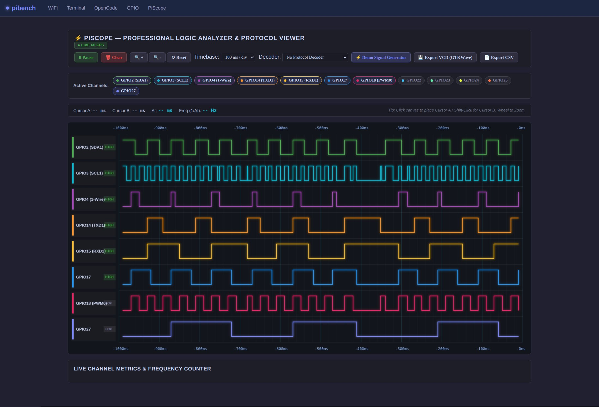

# pibench-server ⚡

> **A minimal, memory-conscious AI agentic server & hardware management portal in Go** — purpose-built for RAM-constrained devices like the Raspberry Pi Zero 2 W (415 MB RAM) and embedded Linux hardware benchmarks.

[](https://go.dev)
[](LICENSE)
[](#overview)

---

## Overview

`pibench-server` is a lightweight, zero-CGO Go server suite designed for single-board computers (such as the Raspberry Pi Zero 2 W). Running heavy Node.js/Bun runtimes (`opencode serve`) on low-RAM devices consumes **100–300 MB RSS**, frequently triggering Linux kernel Out-Of-Memory (OOM) panics.

`pibench-server` combines two purpose-built components into an ultra-low-memory stack running at **~10–15 MB RSS**:

1. **`opencode-tiny/`**: Lightweight Go agent server powering the AI Chat & Tool Calling engine.
2. **`usb-server/`**: HTMX + Go web admin portal featuring the **PiScope** 60 FPS logic analyzer, **GPIO Hardware Manager**, **WiFi Control**, and **Web Terminal**.
3. **`m5-stick-c/`**: ESP32 hardware companion suite providing MicroPython firmware, automated flashing scripts (`uv run flash_m5stickc.py`), analog voltage sampling (`G36` ADC1_CH0 0.0V–3.3V), and ST7735 color LCD status display rendering.

---

## Architecture & Components

```
                    ┌──────────────────────────────────────────────┐
                    │               Browser Client                 │
                    └──────────────────────┬───────────────────────┘
                                           │ HTTP / WS / SSE
                                           ▼
                    ┌──────────────────────────────────────────────┐
                    │  usb-server (Go + HTMX Admin Portal :8080)   │
                    ├──────────────┬───────────────┬───────────────┤
                    │  PiScope     │  GPIO Control │  Web Terminal │
                    └──────┬───────┴───────┬───────┴───────────────┘
                           │               │ UART / G36 ADC
                           ▼               ▼
                    ┌──────────────┐ ┌─────────────────────────────┐
                    │opencode-tiny │ │ M5StickC (ESP32 Companion)  │
                    │  (:3457)     │ │ - G36 Analog Sampling       │
                    └──────┬───────┘ │ - ST7735 LCD Status Display │
                           │         └─────────────────────────────┘
                           ▼
                    ┌──────────────────────────────────────────────┐
                    │ OpenAI Gateway / Local LLM (OpenMind :5000)  │
                    └──────────────────────────────────────────────┘
```

### 1. `opencode-tiny` (AI Agent Server)
- **Ultra-Low Memory Footprint**: Idles at ~10–15 MB RSS.
- **Embedded Web UI**: Single-binary packaging via `go:embed`.
- **Built-in Agentic Tools**:
  - `bash`: Shell execution with timeout safety.
  - `read` / `write` / `edit`: Line-buffered reading, atomic writing, and chunk patch editing.
  - `gpio_control`: AI pin status reading, digital I/O writing, PWM, and peripheral overlay toggling.
  - `host_shell`: Direct shell command execution on any connected host machine (Linux, macOS, Windows PowerShell/CMD, or FreeBSD/BSD) via Reverse SSH bridge (`127.0.0.1:22222`), allowing the AI to access live booted host PCs/workstations zero-config.
  - `superuser_access`: Elevated privilege authentication & password inbox.
- **SQLite Persistence**: Embedded pure Go database (`modernc.org/sqlite`).

### 2. `usb-server` (Admin Portal & Hardware Suite)
- **⚡ PiScope Digital Logic Analyzer**: 60 FPS HTML5 Canvas logic scope with timebase scaling, dual measurement cursors (Cursor A/B with real-time $\Delta t$ microsecond readout & frequency counter), I2C/UART protocol decoders, mouse wheel zooming, and VCD/CSV capture exports.
- **🛠️ Tools & Reverse SSH Host Bridge (`/tools`)**: Auto-detects reverse SSH tunnels, generates copyable 1-liner host connection commands for **Linux**, **macOS**, **Windows (`winget` / PowerShell OpenSSH)**, and **FreeBSD (`pkg`)** (`ssh -R 22222:localhost:22`), manages public SSH keys, and provides host connection installation helpers.
- **🔌 Active Hardware Peripheral Control**: Detects and toggles SPI, I2C, UART Serial, 1-Wire, Hardware Shutdown Button, Fan Control, PWM Audio, and USB Gadget overlays (`raspi-config nonint`).
- **📶 WiFi & Web Terminal**: Interactive web terminal shell (PTY websocket) and network manager.



---

## Quickstart & Installation

### 1. Environment Setup

Copy `.env.example` to create your local `.env` configuration file:

```bash
cp .env.example .env
```

Configure your gateway URL in `.env`:

```env
OPENCODE_TINY_PORT=3457
OPENCODE_TINY_HOST=127.0.0.1
USB_SERVER_PORT=8080
OPENMIND_BASE_URL=http://pibox.local:5000/v1
```

### 2. Build & Deploy

#### Native Build
```bash
# Build opencode-tiny
cd opencode-tiny && go build -o opencode-tiny . && cd ..

# Build usb-server
cd usb-server && go build -o usb-server . && cd ..
```

#### Cross-Compiling for Raspberry Pi (ARM64)
Always cross-compile on your host development machine to save device RAM:

```bash
# Build opencode-tiny for ARM64
cd opencode-tiny && GOOS=linux GOARCH=arm64 go build -o opencode-tiny-arm64 . && cd ..

# Build usb-server for ARM64
cd usb-server && GOOS=linux GOARCH=arm64 go build -o usb-server-arm64 . && cd ..
```

Deploy compiled binaries to your device:

```bash
scp opencode-tiny/opencode-tiny-arm64 <user>@<host_ip>:/tmp/ot-new
scp usb-server/usb-server-arm64 <user>@<host_ip>:/tmp/us-new
ssh <user>@<host_ip> "mv -f /tmp/ot-new /home/<user>/opencode-tiny && chmod +x /home/<user>/opencode-tiny && sudo systemctl restart opencode-tiny.service && mv -f /tmp/us-new /home/<user>/usb-server && chmod +x /home/<user>/usb-server && sudo systemctl restart usb-server.service"
```

Access the admin portal at **`http://<host>:8080/`**.

---

## Configuration Reference

| Environment Variable | Default Value | Description |
| :--- | :--- | :--- |
| `OPENMIND_BASE_URL` | `http://pibox.local:5000/v1` | OpenAI-compatible gateway base URL |
| `OPENCODE_TINY_PORT` | `3457` | HTTP listening port for `opencode-tiny` |
| `OPENCODE_TINY_HOST` | `127.0.0.1` | Network interface binding host |
| `USB_SERVER_PORT` | `8080` | HTTP listening port for `usb-server` admin portal |
| `OPENCODE_TINY_MODEL` | `zen-deepseek-v4-flash-free` | Default active LLM model ID |
| `OPENCODE_TINY_DB` | `~/.local/share/opencode-tiny/opencode-tiny.db` | SQLite session database path |

---

## Systemd Service Installation

### 1. `opencode-tiny.service`
Create `/etc/systemd/system/opencode-tiny.service`:

```ini
[Unit]
Description=opencode-tiny agent server
After=network-online.target
Wants=network-online.target

[Service]
Type=simple
User=<user>
WorkingDirectory=/home/<user>
Environment=OPENCODE_TINY_PORT=3457
ExecStart=/home/<user>/opencode-tiny
Restart=always
RestartSec=3
StandardOutput=journal
StandardError=journal

[Install]
WantedBy=multi-user.target
```

### 2. `usb-server.service`
Create `/etc/systemd/system/usb-server.service`:

```ini
[Unit]
Description=usb-server admin portal (Go + HTMX)
After=network-online.target
Wants=network-online.target

[Service]
Type=simple
User=<user>
WorkingDirectory=/home/<user>/usb-server
ExecStart=/home/<user>/usb-server/usb-server
Restart=always
RestartSec=3
StandardOutput=journal
StandardError=journal

[Install]
WantedBy=multi-user.target
```

Enable and start both daemons:

```bash
sudo systemctl daemon-reload
sudo systemctl enable --now opencode-tiny.service usb-server.service
```

---

## License

Distributed under the **[MIT License](LICENSE)**. © 2026 **bdragoncore**.  
Based on [OpenCode](https://github.com/sst/opencode) (MIT License).
